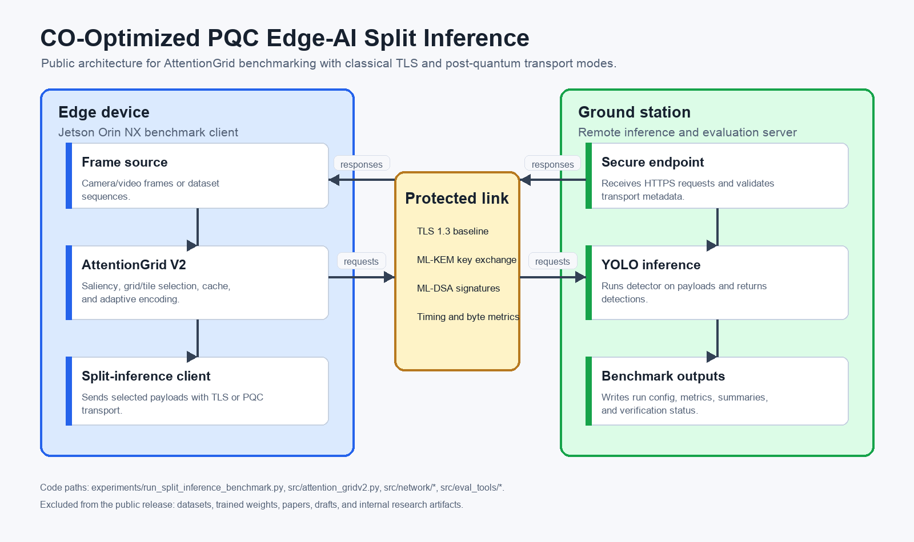

# CO-Optimized PQC Edge-AI Split Inference

> This is a public, demo/review version of a larger project. Datasets, trained weights, and the server-GPU energy campaign are private, so the public results here come from a smaller subset and some numbers differ from the full private work. The trusted public source is `results/verified_summary.csv`.

## Overview

This repository contains a sanitized implementation of an AttentionGrid split-inference benchmark for edge video analytics under classical TLS and post-quantum transport modes. The benchmark compares full-frame cloud inference against AttentionGrid tile selection on an edge client, with optional application-layer classical or PQC hybrid protection around each request.

## Quick Technical Review

- Inspect the AttentionGrid selection and adaptive-encoding path in [`src/attention_gridv2.py`](src/attention_gridv2.py).
- Follow request framing and cryptographic protection through [`pqc_protocol.py`](src/network/pqc_protocol.py) and [`pqc_crypto.py`](src/network/pqc_crypto.py).
- Check the [verified public results](results/verified_summary.csv) with [`scripts/verify_public_results.py`](scripts/verify_public_results.py); no private dataset or model weights are required.

## What Problem This Solves

Edge devices often have limited compute and uplink bandwidth, while remote inference adds network and cryptographic cost. This project evaluates whether co-optimizing attention-based tile selection and transport security can reduce uploaded data while preserving detection quality and verifiable transport behavior.

## System Architecture



Core paths:

- `experiments/run_split_inference_benchmark.py`: experiment runner for edge/cloud and baseline/AttentionGrid modes.
- `src/attention_gridv2.py`: saliency, grid/tile selection, and adaptive encoding.
- `src/network/`: HTTPS inference server, client protocol, and classical/PQC transport helpers.
- `src/eval_tools/`: dataset discovery, detection metrics, unique-object recall, and system telemetry.
- `configs/`: scene-level AttentionGrid configuration and curated PQC sweep pairs.
- `scripts/`: Jetson smoke-test runner, public PQC sweep runner, and public result verifier.

## Hardware and Software Requirements

Tested project runs targeted:

- Edge client: NVIDIA Jetson Orin NX class device.
- Ground station: CUDA-capable Linux host for YOLO inference.
- Python 3.10+.
- NVIDIA CUDA/PyTorch stack appropriate for the target Jetson or ground-station platform.
- `git`, `cmake`, and build tools for `liboqs-python`.

The public repository does not include datasets, trained weights, generated labels, raw benchmark runs, certificates, or private environment files.

## Build Instructions

Run from the repository root.

```bash
python3 -m venv .venv
source .venv/bin/activate

# On Jetson, install the NVIDIA-supported PyTorch/torchvision wheel first.
pip install -r requirements.txt
```

Generate a self-signed server certificate on the ground station:

```bash
./src/network/generate_cert.sh GROUND_STATION_IP
```

Copy `src/network/certs/server.crt` to the edge client if the server and client are on separate machines.

## Run and Reproduce

Expected dataset layout under the repository root:

```text
ua_detrac/content/UA-DETRAC/DETRAC_Upload/images/val/...
ua_detrac/content/UA-DETRAC/DETRAC_Upload/labels/val/...
ua_detrac/content/UA-DETRAC/DETRAC_Upload/labels_with_ids/val/...
mot17/MOT17/train/...
```

Start the ground-station server:

```bash
PYTHONPATH=src python -m network.server \
  --host 0.0.0.0 \
  --port 8443 \
  --weight yolo11s.pt \
  --device cuda \
  --no-prompt
```

Run a Jetson Orin smoke test for AttentionGrid + PQC:

```bash
REMOTE_URL=https://GROUND_STATION_IP:8443/infer \
REMOTE_CAFILE=src/network/certs/server.crt \
MAX_SEQUENCES=1 \
./scripts/run_jetson_orin_experiment.sh
```

Additional reproduction notes are in `docs/reproduction.md`.

Run a specific public-result operating point:

```bash
PYTHONPATH=src python experiments/run_split_inference_benchmark.py \
  --dataset ua_detrac \
  --mode cloud_ag \
  --crypto-mode pqc \
  --pqc-kem ML-KEM-768 \
  --pqc-sig ML-DSA-65 \
  --remote-url https://GROUND_STATION_IP:8443/infer \
  --remote-cafile src/network/certs/server.crt \
  --non-interactive
```

Run the curated PQC sweep used by the public summary:

```bash
REMOTE_URL=https://GROUND_STATION_IP:8443/infer \
REMOTE_CAFILE=src/network/certs/server.crt \
DATASET=ua_detrac \
MODE=cloud_ag \
./scripts/run_public_pqc_sweep.sh
```

## Key Verified Results

The released summary is `results/verified_summary.csv`. It contains 340 rows: 85 transport configurations for each dataset/mode combination across UA-DETRAC cloud baseline, UA-DETRAC cloud AttentionGrid, MOT17 cloud baseline, and MOT17 cloud AttentionGrid. Verification status, signature/decryption failure counts, payload hash checks, timing, bandwidth, accuracy, and telemetry metrics are included.

Verify the public summary:

```bash
python scripts/verify_public_results.py
```

Selected rows copied exactly from `results/verified_summary.csv`:

| Dataset | Mode | Transport | Sequences | Frames | FPS | mAP_50 | Unique recall | Net upload MB | Avg RTT ms | Avg PQ sign ms | Verification |
|---|---|---|---:|---:|---:|---:|---:|---:|---:|---:|---|
| ua_detrac | cloud_baseline | classical | 40 | 56340 | 14.575426082404524 | 0.7887680386454994 | 0.995519413376781 | 341.5926197052002 | 38.531959471702606 | 0.0 | True |
| ua_detrac | cloud_baseline | ML-KEM-768 + ML-DSA-65 | 40 | 56340 | 14.028069088272435 | 0.7887680386454994 | 0.995519413376781 | 349.4945358276367 | 39.89171083152946 | 2.821906350675323 | True |
| ua_detrac | cloud_ag | classical | 40 | 56340 | 26.60938899096889 | 0.7023915756083356 | 0.9950082440024337 | 83.27949299812317 | 31.333781755068173 | 0.0 | True |
| ua_detrac | cloud_ag | ML-KEM-768 + ML-DSA-65 | 40 | 56340 | 27.70964249435574 | 0.7023915756083356 | 0.9950082440024337 | 86.36703839302064 | 30.21689020118606 | 1.6222213314265477 | True |
| mot17 | cloud_baseline | classical | 7 | 5316 | 7.7146948806774605 | 0.7380300020467594 | 0.9524993578714935 | 375.42105538504467 | 108.11250126131462 | 0.0 | True |
| mot17 | cloud_baseline | ML-KEM-768 + ML-DSA-65 | 7 | 5316 | 7.62768436135504 | 0.7380300020467594 | 0.9524993578714935 | 379.6815414428711 | 108.79375112063074 | 2.9735494385733494 | True |
| mot17 | cloud_ag | classical | 7 | 5316 | 11.37235775276736 | 0.6639733477363562 | 0.9334837951481472 | 142.3633279800415 | 72.14300010911329 | 0.0 | True |
| mot17 | cloud_ag | ML-KEM-768 + ML-DSA-65 | 7 | 5316 | 11.457471058242273 | 0.6639733477363562 | 0.9334837951481472 | 144.95119789668493 | 73.59846595946367 | 2.1176792730235716 | True |

## Expected Output

Each experiment writes to:

```text
runs/<timestamp>_<mode>_<dataset>/
```

Expected files include `run_config.json`, `per_sequence_results.csv`, `summary.csv`, and, for sweeps, `master_summary.csv` plus one subdirectory per transport configuration.

## Limitations

- Full reproduction requires the supported datasets, YOLO weights, certificates, and suitable edge/server hardware.
- The public release includes verified summaries, not raw internal benchmark directories.
- Jetson installation depends on the NVIDIA-provided PyTorch/CUDA package set for the specific JetPack version.
- AttentionGrid behavior depends on scene configuration files in `configs/`; changing dataset splits or camera scenes requires re-tuning or adding scene configs.

## Sanitization Note

This is a sanitized academic/portfolio version. Proprietary research artifacts, internal documents, unpublished manuscripts, and private datasets are excluded.
